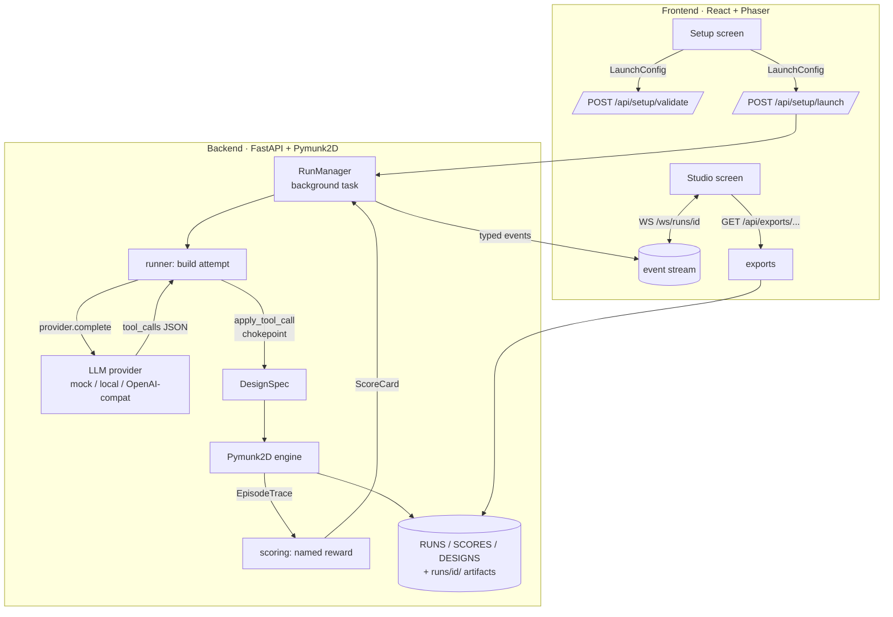

# Architecture

Agentarium is a setup-first loop: you configure a run, an LLM agent builds a
design by emitting **validated tool calls**, a physics engine simulates it into
an engine-neutral **trace**, the trace is scored by a named **reward**, and the
Studio replays the trace while streaming live events. This document maps the
pieces and the invariants that keep them swappable.

## The loop

```
Setup → LaunchConfig → validate → launch → agent tool calls → DesignSpec
      → engine.simulate → EpisodeTrace → reward → ScoreCard → replay + score
      → (memory) → next attempt
```



## Components

| Layer | Path | Responsibility |
| --- | --- | --- |
| Schemas | `backend/agentarium/core/schemas` | Pydantic v2 models: `LaunchConfig`, `DesignSpec`, `EpisodeTrace`, `ScoreCard`, tool defs. |
| Tools | `backend/agentarium/tools` | Registry of 24 tools + the single `apply_tool_call` mutation chokepoint. |
| Engines | `backend/agentarium/engines` | `EngineAdapter` base + Pymunk2D engine producing engine-neutral traces. |
| Agents | `backend/agentarium/agents` | Providers (mock / localdeploy / OpenAI-compatible / manual), prompts, and the attempt runner. |
| Services | `backend/agentarium/services` | `RunManager` orchestrator, scoring, presets, run store, exports. |
| API | `backend/agentarium/api` | Routers: setup, tools, presets, runs, exports, WebSocket. |
| Renderer | `frontend/src/phaser` | Isometric Phaser scene that consumes **only** `EpisodeTrace`. |
| Screens | `frontend/src/screens` | Setup (config) and Studio (live run + replay). |

## Invariants (do not violate)

1. **Agents only emit validated tool calls.** Every design mutation goes through
   `tools/apply.py::apply_tool_call`. Agents never touch the engine, renderer, or
   filesystem directly; out-of-range/non-finite args are rejected before they can
   reach (and crash) the physics engine. High-risk tools default off.
2. **The renderer consumes only `EpisodeTrace`.** No engine internals leak to the
   frontend, so the engine stays swappable (Pymunk2D now, PyBullet3D later).
3. **`LaunchConfig` is the single source of truth** from the Setup screen; the
   backend Pydantic models and the frontend `api/types.ts` stay in sync.
4. **Scoring derives metrics from the trace**, via named pluggable rewards — never
   from the engine.
5. **Multi-agent attribution** is carried end to end: per-call `agent_id`,
   per-part `created_by`, and per-agent events.

## Tools

24 tools across five categories, gated per run by `LaunchConfig.tools.enabled`.
High-risk or advanced tools are off by default.

| Category | Tools | On by default |
| --- | --- | --- |
| building | `create_body`, `add_joint`, `add_motor`, `add_beam`, `add_ramp`, `add_ball`, `add_bin` | 7 / 7 |
| sensors_control | `add_sensor`, `set_controller`, `get_state` | 3 / 3 |
| physics_materials | `set_material`, `set_friction`, `set_density`, `set_collision_group`, `set_gravity` | 2 / 5 |
| simulation_inspection | `run_simulation`, `inspect_score`, `inspect_failure_events`, `compare_attempts` | 3 / 4 |
| evolution_utilities | `mutate_design`, `save_best_design`, `repair_invalid_design`, `name_design`, `export_design` | 4 / 5 |

Each tool has a JSON-schema `input_schema`; `apply_tool_call` enforces required
fields, types, enums, numeric bounds, finiteness, and array lengths before
mutating the design.

## Scoring

`compute_metrics(trace, design)` derives a flat, deterministic metrics dict
(distance, stability, falls, energy, spread, bin containment, …). A **named
reward** maps that to `(score_total, success, summary)`:

| Reward | Used by | Idea |
| --- | --- | --- |
| `distance_plus_stability` | Bridge Builder, Crawl | Reward horizontal travel + stability, penalize falls. |
| `sorting_accuracy` | Sorter | Fraction of dynamic bodies that end up inside a target bin. |
| `city_score` | Tiny City | Structure count + spread area + stability. |
| `default` | baseline | Distance-only fallback. |

Rewards are pure functions registered in a `REWARDS` dict, so adding one is a
single function plus a name — no engine or renderer changes.

## Multi-agent modes

Set via `LaunchConfig.agents.mode`. Each tool call carries its author's
`agent_id`; each created part carries `created_by`.

| Mode | Status | Behavior |
| --- | --- | --- |
| `single` | ✅ live | One agent iterates over capped attempts. |
| `competitive` | ✅ live | Each participant runs its own attempts; highest score wins (A = violet, B = sky). |
| `cooperative` | ✅ live | All participants build **one shared design**, scored once; parts attributed per agent. |
| `relay`, `sandbox` | 🔜 planned | Currently run via the single-agent path. |

## Persistence

Run artifacts are written to `runs/{run_id}/` (`design.yaml`, `trace.json`,
`toolcalls.jsonl`, `score.json`) and also kept in bounded in-memory stores
(`RUNS` / `SCORES` / `DESIGNS`, oldest evicted past a cap; the orchestrator evicts
oldest *finished* runs). SQLite persistence is a planned follow-up.

## Determinism

Worlds are seeded and `dt` is fixed, so a trace is replayable on its own. Tests
use the `mock` provider (no network) and short simulations, so the full suite is
fast and deterministic.

## See also

- [`COMPREHENSIVE_PLAN.md`](COMPREHENSIVE_PLAN.md) — product + UI spec.
- [`IMPLEMENTATION_STEPS.md`](IMPLEMENTATION_STEPS.md) — the Step 1–27 build guide.
- [`GAP_ANALYSIS.md`](GAP_ANALYSIS.md) — known gaps and deferred items.
- [`examples/`](examples/) — a real generated run report + scorecard.
